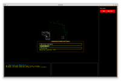
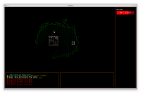
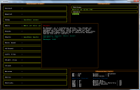
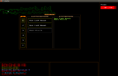

# Amarlon</h2>
<i>A roguelike and cRPG game hybrid.</i>  

Read more at github wiki: https://github.com/lonski/amarlon/wiki 
Visit Amarlon webpage: http://amarlon.lonski.pl

### What is Amarlon (or what I wish it will be) ?

Amarlon is a cRPG game made in ASCII graphics. The look is similar to roguelike games like ADoM (my favorite one!) or Nethack. However I wish to make a role-playing game, with some story and interesting quests, than hack'n'slash dungeon walker. That's why I'm working on adopting Basic Fantasy Rolepalying Game (a system similar to Dungeons and Dragons, but much simpler) rules into Amarlon. I'm inspired by my favourite cRPG games, which are Baldur's Gate, Neverwinter Nights and Ice Wind Dale.

### A taste of the look

